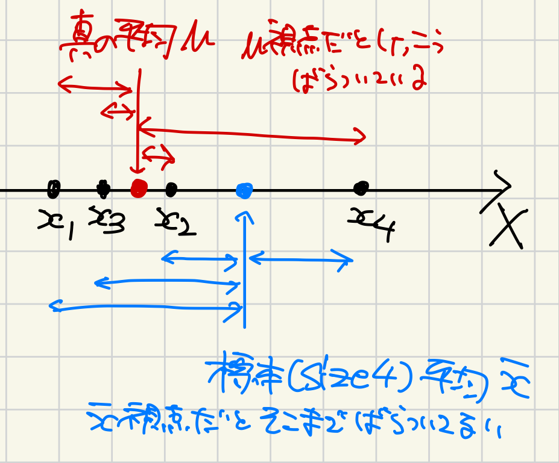

# Contents

[:contents]

## 3行まとめ

1. 推定量は、標本から母数をズバリと一意に推定(点推定)するために使う、標本から得られる量のこと。
2. 推定量に満たしてほしい性質として代表的なものが一致性と不偏性。
3. その心は、たくさん実験or観測したら報われてほしいじゃん？という気持ちがあるから。

## 参考書籍

入門詐欺として有名な[統計学入門](https://amzn.to/4dmDECE)を使って勉強しています。
シェビチェフの不等式は104ページに記載があり、不偏性、一致性の議論は219ページ以降に記載があります。

## 免責事項

間違いのないように理解したいという思いで学習をしていますが、なにぶん独学であり、専門ではありませんので、あくまでも私はこう解釈した、という内容であることご了承ください。
本文において断定調で記載している部分もありますが、いちいち「〜と私は理解しています」と記載すると冗長になってしまうので、体裁上「〜です」と記載しています。
決定的な誤りや、危険な解釈をしていると思われた場合は忌憚なくご指摘いただけますと幸いです。

## 前回のあらすじ

＜過去記事貼付＞

3行要約

1. 推定量は、標本から母数をズバリと一意に推定(点推定)するために使う、標本から得られる量のこと。
2. 推定量に満たしてほしい性質として代表的なものが一致性と不偏性。
3. その心は、たくさん実験or観測したら報われてほしいじゃん？という気持ちがあるから。

今回は、お気持ちがわかった一致推定量と不偏推定量について、母平均と母分散を題材に、数学的な証明をしてみたいと思います。

## 証明

前回と同様に、以下の具体例を考えていきます。
> 全20代日本人男性の身長の平均値$\mu$と分散$\sigma^2$が知りたいので、ランダムに独立に20代日本人男性を$n$人呼んできて身長(測定値$X_i$)を測りました！
以下の**母平均と母分散は神のみぞ知るこの世の真実**であり、今回集めた$n$人でこの世の真実を当てたい、という設定です。
$$
\begin{align*}
  E(X_i)&=\mu & 母平均\\
  V(X_i)&=\sigma^2 = E[(X_i-\mu)^2]  & 母分散\\
\end{align*} \\
X_1, \dots X_n はそれぞれ独立
$$

### 不偏性

> - 定義
>   - その推定値の期待値が母数に一致すること
> - お気持ち
>   - 仮に<ins>たくさん調査or実験したら</ins>、たくさんの推定値が得られるやん？その平均値(=期待値)を取ったら、母数に一致するんちゃう？
>   **たくさん実験しても母数に一致しなかったら困るやろ？**

こちらはそれほど難しくなく、式を展開していくのみ。

#### 標本平均$\bar{X}$の不偏性

$$
\begin{align*}
  E(\bar{X}) &= E(\frac{1}{n} \sum_{i=1}^{n}X_i) \\
  &=\frac{1}{n} \sum_{i=1}^{n} E(X_i) & \footnotesize 期待値の加法性を利用 \\
  &= \frac{1}{n} n \mu = \mu
\end{align*}
$$
標本平均の期待値は母平均に一致することから標本平均は母平均の不偏推定量であることが示された。

#### 標本分散$S^2$の不偏性と不偏分散$s^2$

$$
\begin{align*}
  E(S^2) &= E(\frac{1}{n} \sum_{i=1}^{n}(X_i-\bar{X})^2) \\
  &= \frac{1}{n} E\Big[\sum_{i=1}^{n}(X_i-\bar{X})^2\Big]
\end{align*}
$$
ここで$E\Big[\sum_{i=1}^{n}(X_i-\bar{X})^2\Big]$に着目します。
気持ちとしては、$E[(X_i-\mu)^2]$だったら母分散$\sigma^2$なのになぁ、です。
期待値の加法性によって、$E(\sum X_i) = \sum E(X_i)$であることを随所に利用します。
$$
\begin{align*}
  E\Big[\sum_{i=1}^{n}(X_i-\bar{X})^2\Big] &=
    E\Big[\sum_{i=1}^{n}\big((X_i-\mu) - (\bar{X}-\mu)\big)^2\Big] \\
    &= E\Big[\sum_{i=1}^{n}(X_i-\mu)^2 \Big]
      -2 E\Big[\sum_{i=1}^{n}(X_i-\mu)(\bar{X}-\mu)\Big]
      + E\Big[\sum_{i=1}^{n}(\bar{X}-\mu)^2\Big] \\
    &= \sum_{i=1}^{n} E\Big[(X_i-\mu)^2\Big]
      -2E\Big[(\bar{X}-\mu)\sum_{i=1}^{n}(X_i - \mu)\Big]
      +n E\Big[(\bar{X}-\mu)^2\Big]\\
    &\footnotesize ここで第1項の\sumの中は定義より母分散\sigma^2であり、\\
    &\footnotesize 第2項は\sum_{i=1}^{n}(X_i - \mu)=(\sum_{i=1}^{n}X_i - \sum_{i=1}^{n}\mu)=(n\bar{X}-n\mu)なので\\
    &= n\sigma^2 - nE\Big[(\bar{X}-\mu)^2\Big] \cdots (1)\\
\end{align*}
$$
なんか変なの($E[(\bar{X}-\mu)^2]$)出てきた。

ここで、$\bar{X}$は確率変数$X_i (i=1,...n)$の平均値なので、$\bar{X}$自体もまた確率変数であって。
そして$\bar{X}$の期待値は上でも計算した通り$\mu$なので、$E[(\bar{X}-\mu)^2]$は$\bar{X}$(標本平均)の分散を意味している。
分散の加法性($X_1, \dots X_n$がそれぞれ独立だから成り立つ)より、
$$
\begin{align*}
  E[(\bar{X}-\mu)^2] &= V(\bar{X}) \\
  &=V\Big[\frac{1}{n} \sum_{i=1}^{n} X_i \Big] \\
  &=\frac{1}{n^2} \sum_{i=1}^{n}V[X_i] \\
  &=\frac{1}{n^2} n \sigma^2 = \frac{\sigma^2}{n} \cdots (2) \\
\end{align*}
$$

お待たせしました、お待たせしすぎたかもしれません。
(1), (2)より、
$$
E\Big[\sum_{i=1}^{n}(X_i-\bar{X})^2\Big] =
  n\sigma^2 - n\frac{\sigma^2}{n} = (n-1)\sigma^2
$$

よって、
$$
E(S^2) = \frac{1}{n}(n-1)\sigma^2 ≠ \sigma^2
$$
となって、普通に標本分散を推定量として使ってしまうと期待値が母数に一致しないんですね。真の分散はほんとはもっと大きいのに、標本分散ではどうしても少し小さく出てしまうってことです。
一方で、不偏分散$s^2$は以下のように期待値が母分散に一致します[^4]。
$$
E(S^2) = \frac{1}{n-1}(n-1)\sigma^2 = \sigma^2
$$
この説明として、n個の確率変数$X$が、平均$\bar{X}$を満たすような標本になるためには、n-1個の$X$は自由な値を取っていいけど最後の1つの$X$は平均が$\bar{X}$になるように値を取らないといけないので、自由度がn-1だから、nではなくてn-1で割っている、というものがありますが、個人的には以下の図のように、**標本分散は標本平均周りのばらつきなので、母平均周りのばらつきと比べるとどうしても小さくなってしまう**、という解釈の方がしっくりきます。

[^4]:というか、そうなるような値を不偏分散と呼んでいます。

### 一致性

> - 定義
>   - サンプルサイズを無限に増やした時、その推定量が母数に限りなく一致すること。
> - お気持ち
>   - めっちゃたくさん<ins>サンプル</ins>を集めることができたら、その推定値はほぼほぼ母数になるんちゃう？
>   **たくさんサンプル集めても母数に一致しなかったら困るやろ？**

一致性は、きちんと証明しようとするとシェビチェフの不等式を持ち出さないといけないのですが、シェビチェフの不等式って、どんな母集団に対しても成り立つ魔法のような、この世の真髄を示すような、不思議で、便利な不等式なので、テンションが上がりますね。

#### シェビチェフの不等式

唐突ですが、これがシェビチェフの不等式です。
$$
\displaystyle P(|X-\mu|\geqq k\sigma) \leqq \frac{1}{k^2} \\
\footnotesize Xは母集団から独立に得られた確率変数 \\
\muはXの期待値(= E(X)) \\
\sigma^2はXの分散(= V(X)) \\
kは任意の正の整数
$$

これが、どんな母集団分布でも成り立つというのだから驚きです。
少し勉強してくると、正規母集団を仮定できるんなら$2\sigma$とか$3\sigma$とかいうのはわかるけど、母集団がどんな分布かろくすっぽ確認もせずに標準偏差とか言われてもなぁ、とか思ってしまうと思う(少なくとも私は思ってた)のですが、シェビチェフの不等式を使えば、どんな母集団分布であっても例えば期待値の$\plusmn2\sigma$範囲内の値が得られる確率は75％以上[^1]である、ということがわかるわけですね。

[^1]:有意水準を危険度5%未満におくのがスタンダードだと考えると$k=4.5$で$1/k^2\eqsim0.05$なので本当に母集団分布に検討がつかないのであれば$4.5\sigma$を見たりすると良いのかもしれません。ただ、$X$の真の期待値や真の分散は神のみぞ知る値なので、我々は標本平均や不偏分散を使うほかなく、そこにはどうしてもバイアスが入ってしまうのですが。

一応証明は、答えさえ知っていれば比較的簡単に可能で、任意の確率変数$X$の確率密度関数を$P(X=x)=f(x)$とおき、$|X-\mu|\geqq k\sigma$を満たす$X$空間を$I$と定義した上で以下の方程式を解いていきます。
つまり、$I$は$\{X \leqq \mu-k\sigma, \quad \mu+k\sigma \leqq X\}$です。
$$
\begin{align*}
  \sigma^2 &= \int_{-\infin}^{\infin} (x-\mu)^2 f(x) dx \quad \footnotesize 分散の定義より \\
  &= \int_{I} (x-\mu)^2 f(x) dx + \int_{\mu-k\sigma}^{\mu＋k\sigma} (x-\mu)^2 f(x) dx \\
  &\leqq \int_{I} (x-\mu)^2 f(x) dx \\
  &\quad \scriptsize 被積分関数(x-\mu)^2 f(x)は二乗和と確率密度関数の掛け合わせで必ず0以上なので成り立つ\\
  &\leqq \int_{I} (k\sigma)^2 f(x) dx \\
  &\quad \scriptsize Iの範囲内では|X-\mu|\geqq k\sigmaなので、(X-\mu)^2\geqq (k\sigma)^2から成り立つ\\
  &=k^2 \sigma^2P(|X-\mu|\geqq k\sigma) \\
  &\quad \scriptsize \int_{I} f(x) dxはXがI空間内の値をとる確率そのものを示す\\
\end{align*} \\
両辺をk^2\sigma^2で割って整理することで\\
P(|X-\mu|\geqq k\sigma) \leqq \frac{1}{k^2}
$$

#### 標本平均の一致性

標本平均をそのままシェビチェフの不等式の確率変数としてぶち込みます。
不偏性に関するところで触れた通り、標本平均の期待値は母平均、標本平均の分散は母分散をサンプルサイズで除した数なので、以下のようになります[^2]。
$$\displaystyle P(|\bar{X}-\mu|\geqq k\frac{\sigma}{n}) \leqq \frac{1}{k^2}$$
さて、一致性を確認するためにこの$n$を無限大にした時にこの不等式がどのような意味を持つか確認してみましょう。

$$
\displaystyle P(|\bar{X}-\mu|\geqq k\frac{\sigma}{n}) \leqq \frac{1}{k^2}
\xrightarrow{n \to \infty}
\displaystyle P(|\bar{X}-\mu|\geqq 0) \leqq \frac{1}{k^2}
$$

これは、**nが無限大だったら標本平均と母平均との差が０より大きくなる確率は$1/k^2$以下である**ということを示しています。
そして、kは任意の正の整数でしたね？つまり右辺は任意の正の有理数を取ってよいことになりますので、実質的に、**nが無限大だったら標本平均と母平均との間に差が生じる可能性は限りなく０に近づく**ということになります。
よって、標本平均の一致性を証明することができました[^3]。

[^2]:なお、ここでの$\mu$と$\sigma$はそれぞれ母平均と母分散の平方根を表しますのでご注意を。こういう、同じ文字なのに微妙に意味が違うのがたくさん出てくるのも苦手意識の原因な気がします。
[^3]:これは実質的に大数の法則の証明でもあります。

#### 標本分散の一致性

標本分散(標本不偏分散も)についても、シェビチェフの不等式を使った証明になります。
標本平均の一致性の証明と同様に、**標本分散(ないし不偏分散)の期待値と分散を求めて不等式に代入し、nを無限大に飛ばした時に分散が0になることを示すことができれば良い**のですが、標本分散(ないし不偏分散)の分散を導出する過程が大変にややこしく、ネット上で公開されている[新潟工科大学の資料](http://takeno.iee.niit.ac.jp/~shige/math/lecture/graduate/data/consist1.pdf)に説明を委ねます。

また母集団分布を正規分布だと仮定できるのであれば、標本不偏分散が自由度n-1の$\chi^2$分布に従うことを利用して$\chi^2$分布の分散から証明に持っていくことも可能です。[都立大の資料](https://tmu-kurata.fpark.tmu.ac.jp/lectures/probability16/note2016-8.pdf)が参考になりました。

## 終わりに

またまた長くなりましたので、「お気持ちと数字をこねくり回したらそうなるんはわかったけど、ほんまにそうなるんかい！？」というところについては、次回、pythonでの簡易的な実験で確認したいと思います。

以上、ご確認のほど、よろしくお願いいたします。
